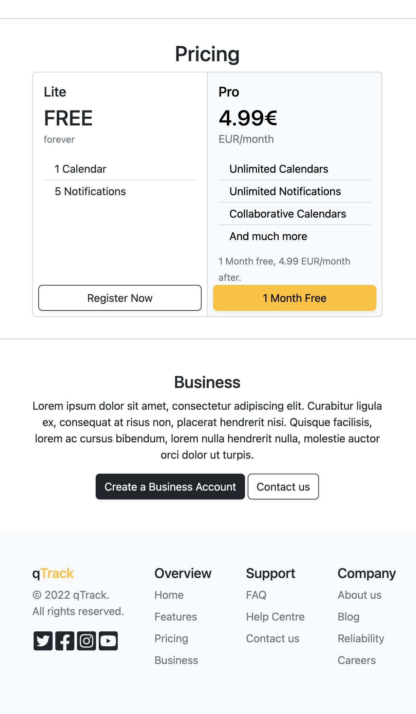

# qTrack

A time tracking & calendar application.

### Index view

<kbd>

</kbd>
<kbd>

</kbd>

### Day View & Week View

<kbd>

</kbd>
<kbd>

</kbd>

### Month view & Add new event

<kbd>

</kbd>
<kbd>

</kbd>

### Home View

<kbd>

</kbd>
